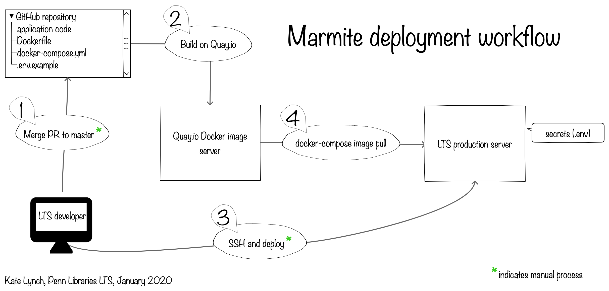

# README for `marmite`

Marmite is an [ETL](https://www.webopedia.com/TERM/E/ETL.html) Sinatra application for creating and displaying harvestable metadata into various distillations for use by external services.

## Table of contents

* [Requirements](#requirements)
* [Functionalities](#functionalities)
* [Development setup](#development-setup)
* [Running the Test Suite](#running-the-test-suite)
* [Production setup](#production-setup)
* [Contributing](#contributing)
* [License](#license)


## Requirements

* Ruby 2.4.x
* MySQL
* An Alma API key with read access to Bibs API sourced to the $ALMA_KEY environment variable.  Consult the [alias.example](alias.example) in this repository for an aliasing example.
* Docker for production and docker-compose version 2 or higher

## Functionalities

The application makes the following XML metadata formats available:

* `marc21` - descriptive metadata transformed from Alma bib and holdings XML payloads, with minor term transformations and fixes for ease of machine processing
* `structural` - structural metadata transformed from dla structural XML payloads, in [Bulwark](https://github.com/upenn-libraries/bulwark)-compliant format
* `dla` - marc21 descriptive metadata and a DLA-compliant structural XML payload
* `openn` - descriptive and structural metadata in a single paylod, in the format used by the OPenn package generation tools
* `iiif_presentation` - IIIF presentation 2.0 manifests

## Development setup

* Clone the repository.
* Run ```bundle install```
* Build Docker MySQL image 
```
docker build -t marmite-mysql db
docker run -p 3306:3306 -d --name marmite-mysql marmite-mysql
```
* Run ```rake db:create && rake db:migrate```
* Run ```rackup```
* Visit [http://localhost:9292/harvesting](http://localhost:9292/harvesting) to learn available commands and endpoints.

Later, to start db image:
```
docker start marmite-mysql
```

To remove Docker MySQL image
* ```docker rm -f marmite-mysql```

## Running the Test Suite

* Run through development setup
* Run MySQL docker image
* Ensure test DB is up-to-date 
```
rake db:migrate RACK_ENV=test
```
* Run `rspec`

## Production setup

* Clone the repository.

  Ensure that the image tag in the `docker-compose.yml` matches the version of the image from [Quay.io](https://quay.io/repository/upennlibraries/marmite?tag=latest&tab=tags) that you want to deploy.

* Copy ```.env.example``` into a file alongside it called ```.env```.

* Populate the new file with the appropriate values, including a valid Alma API key.

* Run ```NFS_ADDR=xyz.int NFS_DEVICE=":/abc/xyz" docker-compose up -d```

  Where the `NFS_ADDR` and `NFS_DEVISE` values correspond to correct values for the NFS machine address and device path.

## Deployment workflow 

This illustration represents the current deployment workflow for marmite.


## Contributing

Bug reports and pull requests are welcome on GitHub at [https://github.com/upenn-libraries/marmite](https://github.com/upenn-libraries/marmite).

## License

This code is available as open source under the terms of the [Apache 2.0 License](https://opensource.org/licenses/Apache-2.0).
